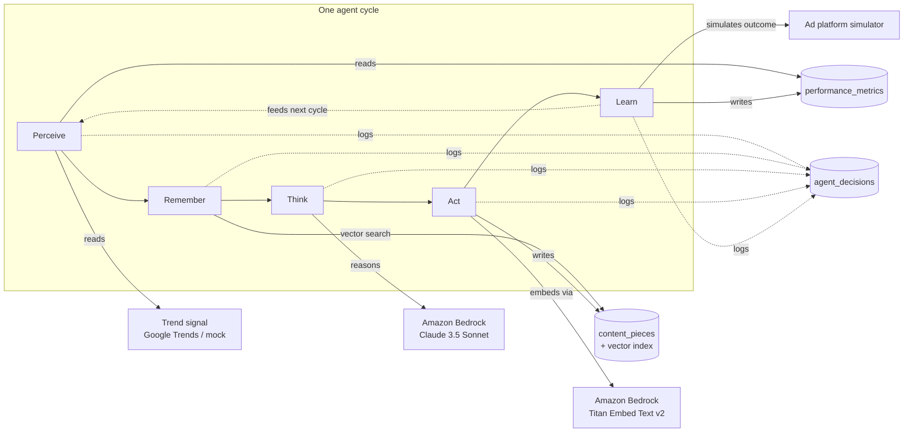

# Architecture

## The loop

Humin runs a five-phase cycle per campaign. Each phase is a discrete,
logged step - nothing happens silently.

## Data flow, in words

1. **Perceive** - pull this campaign's recent `performance_metrics` from
   CockroachDB, compute a trend label (declining / flat / improving), and
   fetch one live read-only signal (Google Trends topic score, or a mock
   equivalent). Both go into `agent_decisions` as an audit entry.

2. **Remember** - embed a short description of the current situation
   (product, audience, goal, live trend, performance trend) via Bedrock
   Titan, then run a cosine-distance nearest-neighbour query against
   `content_pieces.embedding` using CockroachDB's **distributed vector
   index** - across *every* campaign and region in the cluster, not just
   this one. This is Humin's actual long-term memory: precedent, not just a
   log.

3. **Think** - hand the campaign's own recent cycle-by-cycle history +
   recalled precedent (each with its real outcome, not just a headline) +
   trend signal to Claude 3.5 Sonnet on Bedrock. It returns one of five
   decisions - `keep` / `tweak` / `pivot_angle` / `pivot_channel` / `kill` - plus a *named* breakdown of why: a performance assessment, a memory
   assessment, and a trend assessment, each expected to cite real numbers
   rather than vibes. Two things happen after the model responds, in code,
   not in the prompt: a data-driven `evidence_strength` score (sample size +
   cycle count + memory-precedent quality) is averaged into the confidence
   the model self-reported, and a guardrail caps `pivot_*`/`kill` back down
   to `tweak` whenever the evidence behind them is thin - bold moves have to
   earn their evidence, they can't just be asserted by the model.

   A second guardrail runs alongside it: an opt-in per-campaign `budget_usd`
   cap. Once spend-to-date is within 15% of the cap, `pivot_*` gets downgraded
   to `tweak` (no new experiments started this close to the limit); once the
   cap is actually exceeded, the decision is forced to `kill` regardless of
   what the model or the evidence guardrail concluded - a campaign doesn't
   get to keep spending because it's "confident."

4. **Act** - embed the new content, write it to `content_pieces` (so it
   becomes recallable memory for *future* cycles, any campaign), and log the
   decision. If the final decision is `kill`, this step instead pauses the
   campaign (`status` → `paused`) and skips content generation entirely.

5. **Learn** - a synthetic ad-platform simulator produces an outcome for the
   new content, shaped by the agent's own confidence, whether it pivoted,
   and the trend score. That outcome is written to `performance_metrics` - which is exactly what the *next* cycle's Perceive phase reads. The loop
   closes on itself.

## Why this is "agentic memory," not just a database

- **Cross-campaign, cross-region recall.** A campaign launched in
  `eu-central` this morning can recall what worked for a similar audience in
  `us-west` last week - a single global vector index makes that a single
  query instead of a federation problem.
- **Full provenance.** `agent_decisions` is not a log line - it's five typed
  rows per cycle (`perceive`/`remember`/`think`/`act`/`learn`), each with
  structured `detail` JSON, so both the dashboard and any future agent can
  reconstruct *why* a piece of content exists.
- **Durable under failure.** Because state lives in CockroachDB rather than
  in-process, a Lambda invocation (or a whole AWS region) can die mid-cycle
  without losing what the agent has learned - the next invocation picks up
  from the same committed rows.

## Deployment shape (AWS)

- **Amazon Bedrock** - hosts both models the agent calls (`Think` and the
  embedding calls in `Remember`/`Act`). No self-hosted inference.
- **AWS Lambda** (`infra/lambda/handler.py`) - a scheduled/triggered entry
  point that calls `run_cycle()` for each active campaign; the FastAPI app
  in `backend/` can run the same code path locally or on ECS/Fargate for the
  live demo API the frontend talks to.
- **Amazon EventBridge** - puts the Lambda above on a recurring schedule
  (`infra/README.md` has the exact `aws events put-rule` steps) so cycles
  run on their own in production, not only when someone opens the
  dashboard. For live demos where a deployed AWS stack isn't in front of the
  judges, `backend/app/scheduler.py` provides an in-process equivalent,
  toggled from the dashboard, that calls the identical
  `run_all_active_campaigns()` function on an interval.
- **CockroachDB Cloud** - the only stateful component. Multi-region by
  schema design (`campaigns.region`), reachable from Lambda and from the
  FastAPI service alike.
